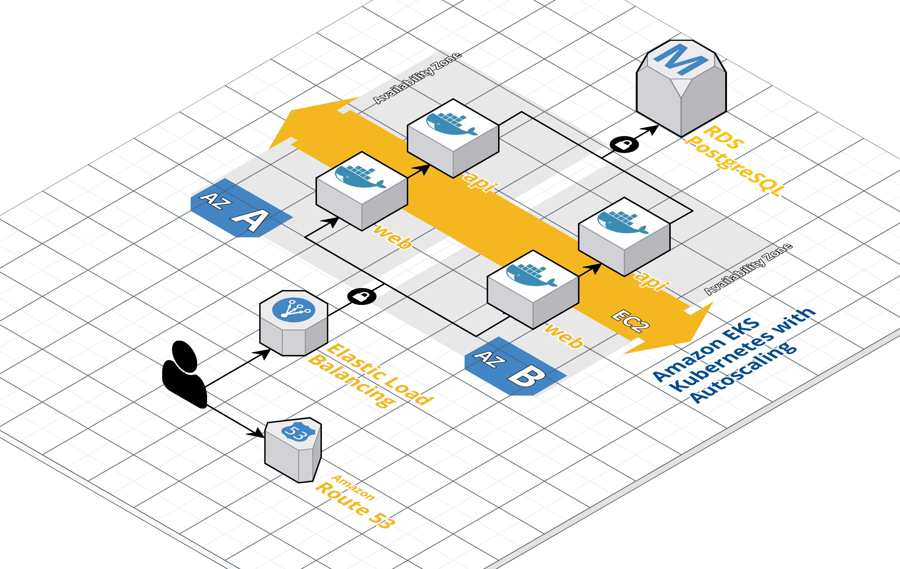
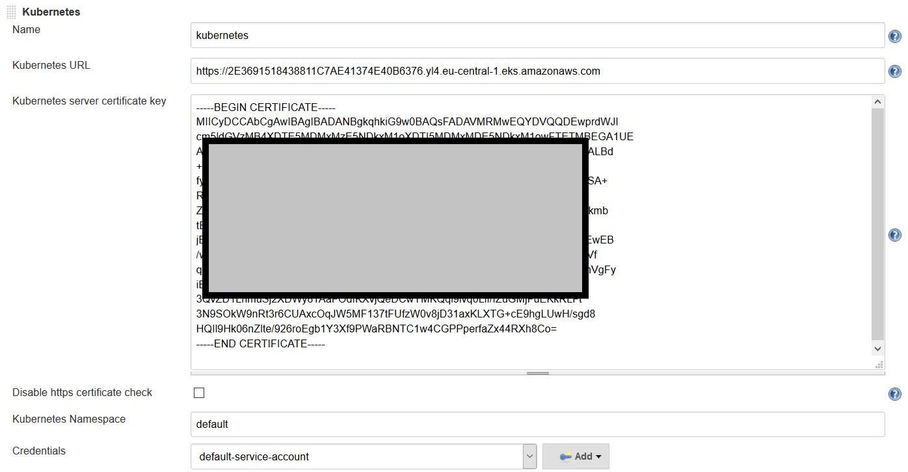

# NodeJS 3tier App



## Project prerequisites

##### AWS Account:
A non-administrative user with the following permissions is required:

* AmazonEC2ContainerRegistryFullAccess
* AmazonRDSFullAccess
* AmazonEC2FullAccess
* Directly attached policy from here:
https://github.com/terraform-aws-modules/terraform-aws-eks/tree/master/examples/eks_test_fixture (required for EKS)

##### Workstation/control machine
A VM or local laptop with the necessary tools to run the project.
To install the required tools on a Linux machine follow the steps below:

1. Clone this repository on the control machine
2. Execute */scripts/init_workstation.sh*
3. If you already have some of the tools installed, you can validate with */scripts/init_workstation.sh test*

## Provision the infrastructure
To provision the project's infrastructure in AWS, first set up the necessary terraform providers and then plan and apply the configurations:
```
1. cd terraform
   terraform init
2. terraform plan -var-file=variables.tfvars
3. terraform apply -var-file=variables.tfvars
```
To clean up the environment:
```
4. terraform destroy -var-file=variables.tfvars
```

## Test the application

To make sure that the infrastructure has been provisioned and that the application properly deployed, simply get the Load Balancer endpoint from the *terraform apply* command output and enter the value in a browser. You should be able to see the application. The current timestamp is retrieved from the database. 

## Updating the application

One of the requirements of the project was to have an automatic way of updating the application code without any downtimes. We use a CI/CD Jenkins pipeline for this purpose.

Jenkins is running on a different infrastructure, so it is possible to reuse an existing installation of Jenkins. To set it up for this particular application:


#### 1. Set the below parameters used in the pipeline:

- ECRURL - the URL of the Repository so Jenkins will know where to push the Docker images once they are built.
- EKSURL - the URL of the EKS service where the application will be deployed

#### 2. In order to authenticate Jenkins to Kubernetes, a special plugin is used: https://wiki.jenkins.io/display/JENKINS/Kubernetes+Cli+Plugin

From the terraform apply output, get the server certificate:
echo  certificate-authority-data | base64 --decode  -->> output goes in the



On the workstation, retrieve the service account token:

```
kubectl describe secret $(kubectl get secrets | grep default | cut -f1 -d ' ') | grep -E '^token' | cut -f2 -d':' | tr -d '\t'
```
Create/update credential 'default-service-account' as Secret text and enter the token value. 


Now Jenkins will trigger the "3tier-nodeapp-toptal-pipeline" with every update of the application code. 


